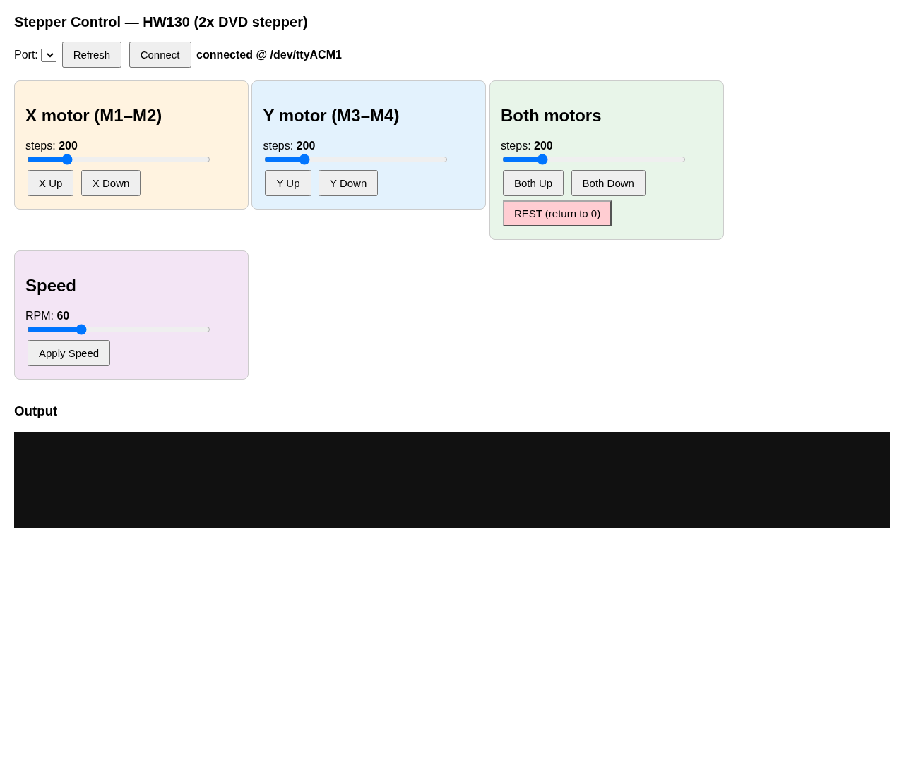

# 3D Writing Robot

Control two DVD-player stepper motors (X and Y axis) using an Arduino Uno with an **HW-130 L293D motor driver shield** — plus a pen-lift servo on the shield's servo header, a web UI, and a Reinforcement Learning package for trajectory tracing.

## Hardware

- Arduino Uno
- HW-130 L293D motor driver shield (2x L293D + 74HC595)
- 2x DVD player stepper motors (4-wire bipolar, ~200 steps/rev)
- 1x standard hobby servo (pen lift) on the shield's SERVO 1 header

### Wiring

- Stepper 1 (X axis): coil A -> M1, coil B -> M2 terminals
- Stepper 2 (Y axis): coil A -> M3, coil B -> M4 terminals
- Servo: signal to SERVO 1 header (**D10** on this HW-130 clone), power to the servo 5V rail
- Power: USB 5V (small DVD steppers) or external 7-12V (recommended). Servo draws peak current — external 5V for the servo rail avoids brown-outs.

## Files

- `dvd_stepper_serial.ino` — Arduino firmware (steppers + servo)
- `stepper_web.py` — Web control UI (sliders + buttons over serial)
- `writing_robot_rl/` — RL training package (see its README)
- `screenshot.png` — Web UI screenshot

## What's Done So Far

### Calibration (measured on the robot)

| Axis | Dead-end steps | Travel (mm) | Steps/mm |
|---|---|---|---|
| X | 275 | 55.0 | 5.0 |
| Y | 250 | 52.0 | 4.8 |

Safe temp rack travel (15-step margin): **X 0–52.0 mm (260 steps)**, **Y 0–48.96 mm (235 steps)**. Both the environment and `HardwareInterface.move_to_mm()` clamp commands to these limits so RL can never drive past the dead ends.

### Firmware (origin 0,0 = home corner)

- `x/y/b <steps>` move X, Y, or both (relative, signed)
- `r` homing returns both motors to 0,0 — firmware prints `Rest position reached` so the host syncs its step count
- `s <rpm>` speed, `h` help
- `p <angle>` **pen servo control** 0–180 (90=up, 45=down) — added this session, compiled & flashed via arduino-cli, verified live
- Robust host side: USB serial drops auto-reconnect and re-home

### Writing (deterministic paths)

- `hw_write_text.py` traces stroke-based vector letters (HELLO, HI, C, K, …) with **pen lift between strokes** — verified writing "HI", "C", "HELLO" on the real robot, all within bounds
- Pen toggles up/down via the `p` command as the head travels between strokes

### Reinforcement Learning (study/self-learning)

- `WritingRobotEnv` (Gymnasium Dict obs) + PPO (Stable-Baselines3), reward = path distance / progress / smoothness / pen / completion
- Hardware rounds (`hw_round.py`): 1 PPO batch per round with a bounds + progress report; weights hot-swappable (`hw_weights.json`). Rounds 1–5 reached **~35% path progress** along an L-shape with zero boundary violations
- Simulation (`hw_train_sim.py`): calibrated to the real bounds (52×49 mm), ~500 FPS vs ~2 FPS on hardware. 100k steps trained with **0 violations**, policy reproducibly traces the vertical arm (~29% progress) — a good sim-to-real transfer checkpoint
- USB drops under sustained motor load are mitigated by auto-reconnect; long hardware rounds are still unreliable (another reason sim training is the main path)

## Arduino firmware

Upload `dvd_stepper_serial.ino` to the Uno (requires the **Adafruit Motor Shield library** / AFMotor, and the built-in Servo library).

```
arduino-cli lib install "Adafruit Motor Shield library"
arduino-cli compile --fqbn arduino:avr:uno dvd_stepper_serial
arduino-cli upload -p /dev/ttyACM0 --fqbn arduino:avr:uno dvd_stepper_serial
```

### Serial commands (9600 baud)

| Command | Action |
|---|---|
| `x <steps>` | Move X motor (+/- direction) |
| `y <steps>` | Move Y motor (+/- direction) |
| `b <steps>` | Move both motors together |
| `r` | Rest — return both motors to 0 position |
| `s <rpm>` | Set speed (e.g. 30-150) |
| `p <angle>` | Set pen servo angle 0–180 (90=up, 45=down) |
| `h` | Help |

## Web UI

```
python3 stepper_web.py
```

Open http://localhost:8000



Features:
- Sliders for X, Y, and Both step amounts (1-1000)
- Up/Down buttons per motor and for both
- REST button to return to the 0 (home) position
- Speed slider with Apply Speed
- Pen servo angle control
- Live output log
- USB port selector (Refresh + Connect) for when the port changes

Requires `pyserial` (`pip install pyserial`).

## Next Steps

- Longer sim training from the current checkpoint to push past the ~29% plateau, then tune reward weights
- Validate the trained sim policy briefly on the real robot (bounds clamped on both sides)
- Deterministic writer (letters/words with pen lift) as the practical drawing path